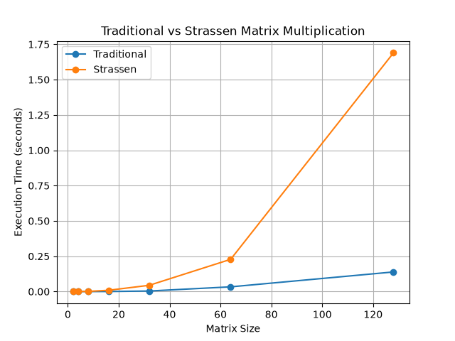

# Lab 3 Report
## Question 1: Matrix Multiplication
### Method

The traditional algorithm multiplies two matrices using three loops while Strassen’s algorithm splits each matrix into four parts and uses seven recursive multiplications instead of eight.

The program creates random matrices, calculates the result using both algorithms, compares the results, and measures time spent for calculations.

### Complexity

- Traditional multiplication: $O(n^3)$
- Strassen's multiplication: approximately $O(n^{2.81})$

### Result

Both methods produced the same matrix.For the smaller matrices, the traditional method was faster because it has less extra recursive work.As the matrix size increases, Strassen's method can become more useful because it performs fewer multiplications.

### Figure

The graph below compares the execution times of both methods.

## Question 2: Karatsuba Multiplication
### Method
In the traditional way, each digit of one number is multiplied with all the digits of the other number.But in Karatsuba’s way of multiplication, the number is divided into various segments, and there are three recursive multiplications instead of four.

it will generate two numbers randomly and will multiply them using both techniques.

### Complexity

- Traditional multiplication: $O(n^2)$
- Karatsuba multiplication: approximately $O(n^{1.585})$

### Result

Both methods produced the same answer.Traditional multiplication is simple and works well for small numbers.Karatsuba multiplication can be faster for numbers with many digits because it reduces the number of recursive multiplications.

## Question 3: Binary Search and Ternary Search
### Method

The program generates a randomly ordered array.Binary search method divides the search range into two halves while ternary search divides the search range into three halves.The program uses both methods to find and not find elements and shows how many comparisons were made.

### Complexity

- Binary search: $O(\log n)$
- Ternary search: $O(\log n)$

### Result

Efficiency is observed in both algorithms in sorted arrays.Binary search makes fewer comparisons since it just considers one middle element at once while ternary search makes two comparisons as it splits the array into three equal parts.

## Overall Conclusion
this lab has shown me that divide and conquer algorithms can lead to improved efficiency when dealing with large data sets.But sometimes the simpler algorithm could be faster when handling small data sets as most advanced algorithms require additional work in their recursion step.
